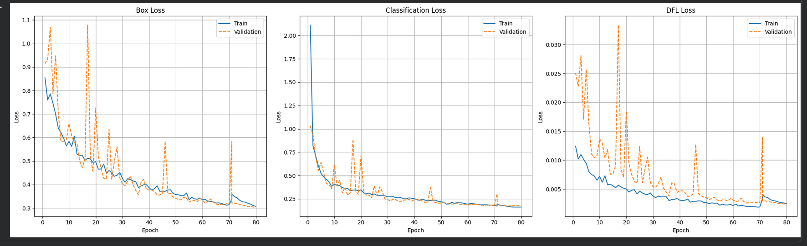
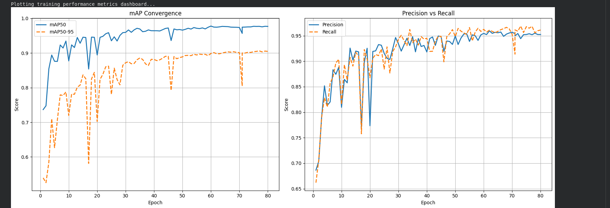

# YOLOv26 Table Layout Detector

A full-stack document intelligence system that detects and segments table structures — including column headers and projected row headers — from document images using a custom-trained YOLOv8 model.

---

## Project Overview

This project fine-tunes YOLOv26 on a dataset of ~3,500 annotated document images to identify three structural elements inside tables:

| Class | Description |
|---|---|
| `table` | Full table bounding region |
| `table column header` | Horizontal header row at the top of the table |
| `table projected row header` | Vertical/left-side row labels |

The system exposes a FastAPI backend for inference, a Next.js frontend for visual interaction, and a GitHub Actions CI pipeline for automated quality checks.

---

## Training Pipeline (Google Colab Notebook)

The model was trained and evaluated end-to-end in `YOLOv26_table_boundary_box_detection.ipynb` using a T4 GPU on Google Colab. The notebook is structured into the following stages:

### Stage 1 — Environment Setup
- GPU availability verified via `nvidia-smi`
- Ultralytics installed with `albumentations` for augmentation support
- Google Drive mounted securely via OAuth 2.0 (`flush_and_unmount` called first to prevent stale directory handles corrupting checkpoints mid-training)

### Stage 2 — Dataset Caching

Training data is copied from Google Drive to local Colab disk before training begins, eliminating network I/O bottlenecks and keeping GPU utilization at 100%.

```
/content/table_dataset/
├── train/   (images + labels)
├── val/     (images + labels)
├── test/    (images + labels) (holdout – never used during training)
└── dataset.yaml
```

**`dataset.yaml`** — the configuration file that tells YOLO where to find images, how many classes exist, and what each class is named:

```yaml
path: /content/table_dataset
train: train/images
val:   val/images
test:  test/images

nc: 3
names:
  0: table
  1: table column header
  2: table projected row header
```

### Stage 3 — Model Training

The YOLOv26 model (`yolo26m.pt`) was trained with the following hyperparameters:

| Hyperparameter | Value | Rationale |
|---|---|---|
| `epochs` | 80 | Maximum training passes |
| `imgsz` | 800 | High-resolution input to match document page density |
| `batch` | 4–16 | Tuned per available T4 VRAM |
| `device` | 0 (GPU) | Locks training to T4 GPU |
| `workers` | 4–8 | Parallel data pre-fetching threads |
| `cache` | True | Dataset loaded into RAM to eliminate disk read lag |
| `amp` | True | Mixed-precision training — cuts VRAM use, speeds up epochs |
| `patience` | 15 | Early stopping if validation mAP stops improving |

**Resume-safe training:** The notebook detects `last.pt` on Drive and resumes from the exact epoch checkpoint if the Colab session disconnects, preventing full restarts on long runs.

### Stage 4 — Loss Curve Analysis

Three loss curves are plotted across all epochs to diagnose overfitting:




| Graph | What it measures |
|---|---|
| **Box Loss** (train vs val) | How tightly predicted bounding boxes align with ground-truth annotations |
| **Classification Loss** (train vs val) | How accurately the model assigns the correct class |
| **DFL Loss** (train vs val) | Distribution Focal Loss — measures confidence calibration of box edge predictions |

A converging train/val gap on all three curves confirms the model is generalizing rather than memorising training data.

Two accuracy metric curves are plotted alongside:

| Graph | What it measures |
|---|---|
| **mAP50** | Mean Average Precision at IoU ≥ 0.50 — standard detection accuracy |
| **mAP50-95** | Stricter average across IoU thresholds 0.50–0.95 — measures localization precision |
| **Precision vs Recall** | Trade-off between false positives (Precision) and missed detections (Recall) |

A **Confusion Matrix** is also rendered for the validation split, showing per-class true positives vs. misclassifications vs. background false positives.

### Stage 5 — Automated Readiness Audit (Validation)

The notebook runs a go/no-go quality gate before approving the model for test-set evaluation:

```
[1] STABILITY GAPS  → Box Delta < 0.20  |  Class Delta < 0.20
[2] ACCURACY SCORES → mAP50 ≥ 0.90     |  mAP50-95 ≥ 0.75
[3] PROFILE BALANCE → Precision & Recall reported per epoch
[4] BEST PEAK       → Best Epoch # identified by peak mAP50-95
```

A **per-class performance table** during validation is printed at this stage:

| Class | Precision | Recall | mAP@0.50 | mAP@0.50:0.95 |
|---|---|---|---|---|
| `table` | 0.9808| 0.9854 | 0.9935 | 0.9888 |
| `table column header` | 0.9724 | 0.9727 | 0.9875 | 0.9191|
| `table projected row header` | 0.9033 | 0.9485 | 0.9498 | 0.8113 |


> Exact metric values are generated at runtime and saved to `results.csv` inside `YOLOv26_TableProject/table_detectorm/` on Google Drive.

---

## Test Set Evaluation

After the validation audit passes, the model is evaluated on a completely held-out test split — data the model has never seen during training or validation.

### Test Configuration

| Parameter | Value |
|---|---|
| Split | `test` (holdout — never seen during training) |
| Confidence threshold | `0.50` |
| IoU threshold (NMS) | `0.75` |
| Input resolution | `800px` |
| Weights | `best.pt` |


A **per-class performance table** is printed at this stage:

| Class | Precision | Recall | mAP@0.50 | mAP@0.50:0.95 |
|---|---|---|---|---|
| `table` | 0.9917| 0.9821 | 0.9843 | 0.9755 |
| `table column header` | 0.9739 | 0.9717 | 0.9666 | 0.9062|
| `table projected row header` | 0.9652 | 0.9067 | 0.9106 | 0.7901 |


### Pass / Fail Criteria

```
Test mAP50    ≥ 0.90   AND
Test mAP50-95 ≥ 0.75
→  PASSED. MODEL MEETS PRODUCTION REQUIREMENTS FOR DEPLOYMENT.
```


The model correctly identified all three structural layers of the table with high confidence you can see this in frontend sample.


## Repository Structure

```
YOLO/
├── .github/
│   └── workflows/
│       └── ci.yml                  # GitHub Actions CI pipeline
├── backend/
│   ├── __init__.py
│   ├── main.py                     # FastAPI application & YOLO inference engine
│   ├── requirements.txt            # Python dependencies
│   ├── weights/
│   │   └── best.pt                 # Trained YOLOv8 model weights (~3,500 images)
│   └── tests/
│       └── test_main.py            # Pytest unit & integration tests
├── frontend/
│   ├── app/
│   │   ├── page.tsx                # Main UI — upload, inference, canvas overlay
│   │   ├── layout.tsx
│   │   └── globals.css
│   ├── public/
│   ├── package.json
│   ├── next.config.ts
│   └── tsconfig.json
├── YOLOv26_table_boundary_box_detection.ipynb   # Training, evaluation & metrics notebook
├── dataset.yaml                                 # YOLO dataset configuration (classes & split paths)
├── .gitignore
└── README.md
```
---


> **`YOLOv26_table_boundary_box_detection.ipynb`** — the full training notebook: environment setup, dataset caching, model training with resume support, loss/mAP/Precision-Recall graphs, Confusion Matrix, automated readiness audit, and holdout test evaluation.

> **`dataset.yaml`** — tells YOLO the dataset root path, the train/val/test image folder locations, the number of classes (`nc: 3`), and the class name list. Keep this in sync with your Google Drive dataset structure before running the notebook.

---

## Tech Stack

### Backend
| Package | Role |
|---|---|
| `fastapi >= 0.111.0` | REST API framework — routes, request handling, interactive `/docs` UI |
| `uvicorn >= 0.30.1` | ASGI web server — binds to a port and serves live traffic |
| `ultralytics >= 8.4.57` | YOLOv8 engine — loads `best.pt` weights and runs inference |
| `python-multipart >= 0.0.9` | Parses incoming binary image file uploads over HTTP |
| `pillow >= 10.4.0` | Converts uploaded bytes into clean RGB images for the model |
| `pytest` | Automated test runner |
| `httpx` | HTTP client used to simulate API requests in tests |

### Frontend
- **Next.js** (App Router) with TypeScript
- Canvas API for bounding-box overlay rendering
- Lucide React for icons
- Tailwind CSS for styling

### CI/CD
- **GitHub Actions** — runs on push/PR to `main` or `master`
- Python 3.13 environment
- `flake8` linting (fatal errors: E9, F63, F7, F82)
- Full dependency install from `backend/requirements.txt`

---

## Getting Started

### Prerequisites

- Python 3.10+
- Node.js 18+
- `best.pt` weights file placed at `backend/weights/best.pt`

### 1. Backend Setup

```bash
# Clone the repo
git clone <your-repo-url>
cd YOLO

# Create and activate a virtual environment
python -m venv venv
source venv/bin/activate        # Windows: venv\Scripts\activate

# Install dependencies
pip install -r backend/requirements.txt

# Start the API server
uvicorn backend.main:app --reload --host 0.0.0.0 --port 8000
```

The API will be live at `http://localhost:8000`. Interactive docs are available at `http://localhost:8000/docs`.

### 2. Frontend Setup

```bash
cd frontend

# Install dependencies
npm install

# Start the dev server
npm run dev
```

The UI will be available at `http://localhost:3000`.

---

## API Reference

### `GET /`
Health check — returns a confirmation that the service is running.

**Response:**
```json
{ "message": "Service is running and ready to accept requests." }
```

### `GET /status`
Returns the current model load state.

**Response:**
```json
{ "message": "YOLO FastAPI is running", "model": "best.pt loaded" }
```

### `POST /predict`
Accepts a `.jpg`, `.jpeg`, or `.png` image and returns all detected table structures.

**Request:** `multipart/form-data` with a `file` field containing the image.

**Response:**
```json
{
  "filename": "document.png",
  "width": 2550,
  "height": 3300,
  "detections_count": 3,
  "detections": [
    {
      "class_name": "table",
      "class_id": 0,
      "confidence": 0.97,
      "bbox": { "x1": 200.0, "y1": 1000.0, "x2": 2000.0, "y2": 2500.0 }
    },
    {
      "class_name": "table column header",
      "class_id": 1,
      "confidence": 0.91,
      "bbox": { "x1": 200.0, "y1": 1000.0, "x2": 2000.0, "y2": 1100.0 }
    },
    {
      "class_name": "table projected row header",
      "class_id": 2,
      "confidence": 0.88,
      "bbox": { "x1": 200.0, "y1": 1100.0, "x2": 600.0, "y2": 2500.0 }
    }
  ]
}
```

**Error responses:**
- `400` — Invalid file format (not JPG/PNG)
- `503` — Model weights not loaded
- `500` — Inference engine error

### `PUT /update_model?weight_path=<path>`
Dynamically swaps the active model weights at runtime without restarting the server.

### `DELETE /delete_model`
Unloads the active model from RAM and disables the `/predict` endpoint.

---

## Model Details

| Property | Value |
|---|---|
| Architecture | YOLOv8 |
| Training images | ~3,500 annotated document pages |
| Inference resolution | 800px (matches training setup) |
| Confidence threshold | 0.5 |
| IoU threshold | 0.5 |
| Weights file | `backend/weights/best.pt` |

The model detects three classes corresponding to structural regions of tables in scanned or digital document images.

---

## Running Tests

```bash
# From the project root with the venv active
pytest backend/tests/ -v
```

The test suite covers:

- **Health endpoints** — `GET /` and `GET /status` return expected responses
- **Input validation** — invalid file extensions are rejected with `400`
- **Mocked inference** — a mock YOLO model verifies all three detection classes are returned correctly with accurate confidence scores and bounding boxes
- **Lifecycle endpoints** — `DELETE /delete_model` unloads the model cleanly

---

## CI/CD Pipeline

The GitHub Actions workflow (`.github/workflows/ci.yml`) runs automatically on every push or pull request to `main` or `master`.

**Steps:**
1. Check out repository code
2. Set up Python 3.13
3. Install all backend dependencies from `requirements.txt`
4. Run `flake8` to catch fatal syntax and import errors (E9, F63, F7, F82)
5. Run a secondary `flake8` pass for complexity and line-length warnings (non-blocking)

---

## Frontend Usage

1. Open `http://localhost:3000` in your browser.
2. Click **"Click to browse filesystem"** and select a document image (JPG or PNG).
3. Click **"Run Layout Analysis"**.
4. Detected regions are drawn directly on the image canvas with colour-coded bounding boxes:
   - 🔵 **Blue** — full table
   - 🟢 **Green** — column header
   - 🟡 **Amber** — projected row header
5. Detection count, image dimensions, and per-detection confidence scores appear in the left panel.

---

## Sample Output
The screenshot below shows a real inference run on a medical benefits document:


### Inference Visualizer Canvas

The model correctly identified all three structural layers of the table with high confidence:

| Detection | Confidence | Colour |
|---|---|---|
| Table | **98.5%** | 🔵 Blue border around the full table region |
| Table Projected Row Header | **95.6%** | 🟡 Amber border on the left-side row label column |
| Table Column Header | **88.4%** | 🟢 Green border on the top header row |

**What the annotated output looks like:**

```
┌─────────────────────────────────────────────────────────┐  ← table 98.5%
│ table projected row header 96% │                        │  ← row header (amber)
│─────────────────────────────────────────────────────────│
│ table column header 88% │  Plan 2  │  PPO  │  Non-PPO  │  ← col header (green)
│─────────────────────────────────────────────────────────│
│ Covered Services             │ PPO Providers │ Non-PPO  │
│ Physician Office Visit...    │    100%       │  70%     │
│ Primary Care Physician       │  no Copay     │  after   │
│ Specialist                   │  after $20    │ Deduct.  │
│ ...                          │    ...        │  ...     │
└─────────────────────────────────────────────────────────┘
```

The left panel simultaneously displays:

- **Targets Located:** `3` — total detections in the image
- **Image Geometry:** `2550 × 3300 px`
- Per-class confidence badges (Table · Table Projected Row Header · Table Column Header)

> The model handles dense, multi-column insurance/benefits documents with footnotes and merged cells, correctly separating the structural skeleton (headers and row labels) from the body content.

---

## CORS Configuration

The backend allows requests from the following origins by default:

- `http://localhost:3000`
- `http://localhost:3001`
- `http://127.0.0.1:3000`
- `http://127.0.0.1:3001`
- `http://192.168.1.84:3000`
- `http://192.168.1.84:3001`

To add additional origins, update the `allow_origins` list in `backend/main.py`.

---

## License

This project is proprietary. All rights reserved.
